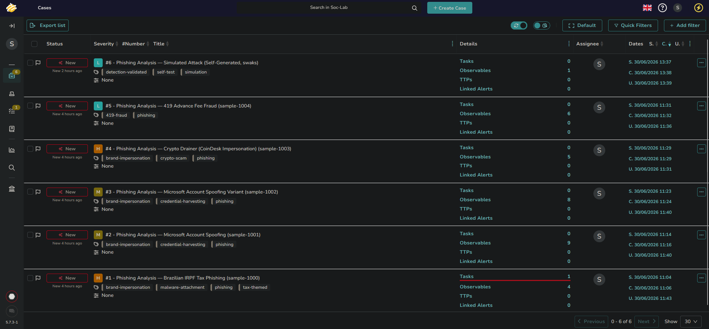
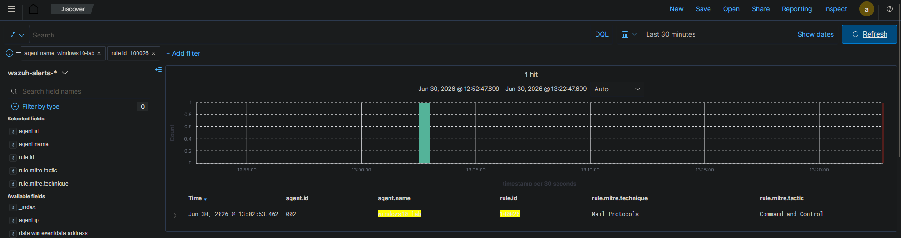

# Lab 3 — Phishing Analysis Pipeline

## Objective
Build a phishing triage pipeline using TheHive and Cortex, analyze real-world
phishing samples across distinct attack types, extract and document IOCs,
and validate detection coverage by simulating and detecting a phishing
delivery attempt end-to-end.

---

## Environment

| VM | Role | OS | IP |
|----|------|----|----|
| soc-core | Wazuh Manager + TheHive + Cortex | Ubuntu Server 22.04 | 192.168.234.141 |
| windows10-lab | Victim + Wazuh Agent + SMTP capture listener | Windows 10 Pro | 192.168.234.140 |
| kali | Attacker / simulation source | Kali GNU/Linux 2026.2 | 192.168.234.129 |

**Stack added this lab:** TheHive 5.7.3, Cortex 3.1.8, Elasticsearch (port 9201,
separate from Wazuh's 9200), Cassandra (TheHive datastore)

---

## Lab Phases

| Phase | Description | Status |
|-------|-------------|--------|
| 1 — Setup | TheHive + Cortex installation and linking | ✅ Complete |
| 2 — Sample Collection | 5 real phishing samples sourced from dataset | ✅ Complete |
| 3 — Header Analysis | Full header/IOC analysis on all 5 samples | ✅ Complete |
| 4 — IOC Extraction | Consolidated master IOC list | ✅ Complete |
| 5 — Case Management | 6 TheHive cases created with observables | ✅ Complete |
| 6 — Detection Validation | Simulated attack, custom Wazuh rule, alert confirmed | ✅ Complete |
| 7 — Documentation | Full GitHub documentation | ✅ Complete |

---

## Phase 1 — Setup

Installed TheHive 5.7.3 and Cortex 3.1.8 on soc-core alongside the existing
Wazuh deployment. Elasticsearch was reconfigured to port 9201 to avoid
conflicting with Wazuh's indexer on 9200. TheHive↔Cortex link configured
and confirmed green.

**Known issue:** Cortex 3.1.8 has an analyst-account login bug via browser;
all Cortex operations performed via the admin account as a workaround.

**Setup guide:** [TheHive + Cortex Setup](./setup/thehive-cortex-setup.md)

---

## Phase 2-3 — Sample Collection & Header Analysis

5 phishing samples selected from a working dataset of 8,615 `.eml` files,
chosen to cover distinct attack types:

| Sample | Campaign | Vector |
|--------|----------|--------|
| sample-1000 | Brazilian IRPF tax phishing | Malicious PDF attachment |
| sample-1001 | Microsoft account spoofing | Credential harvesting |
| sample-1002 | Microsoft account spoofing (variant) | Credential harvesting, rotated infra |
| sample-1003 | Crypto drainer (CoinDesk impersonation) | Wallet drainer URL |
| sample-1004 | 419 advance fee fraud | Social engineering only |

Full per-sample header analysis, including Received-chain reconstruction,
sender authentication review, and IOC identification, documented in
[`./analysis/`](./analysis/).

---

## Phase 4 — IOC Extraction

All IOCs from the 5 samples consolidated into a single master list, with
source attribution and TheHive observable typing for direct import.

→ **[Full IOC master list](./iocs/ioc-master-list.md)**

---

## Phase 5 — Case Management (TheHive)

5 cases created for the real-world samples, one per email, with severity
assigned by payload risk (malicious attachment / financial loss vector
ranked above pure social-engineering fraud). Observables added with IOC
flags set selectively — legitimate shared infrastructure (e.g. Mailgun's
own sending IPs, Google SMTP relays) deliberately left unflagged to avoid
false-positive IOC attribution.

| Case | Sample | Severity | IOC Count |
|------|--------|----------|-----------|
| #1 | sample-1000 (IRPF tax) | High | 4 |
| #2 | sample-1001 (MS spoofing) | Medium | 9 |
| #3 | sample-1002 (MS spoofing variant) | Medium | 8 |
| #4 | sample-1003 (Crypto drainer) | High | 5 |
| #5 | sample-1004 (419 fraud) | Low | 6 |

Cases #2 and #3 cross-linked via TheHive's linked-elements feature to
document campaign correlation (shared landing domain, tracking pixel host,
and attacker Reply-To address across both waves) without merging the two
distinct emails into a single record.


*All cases listed in TheHive — severity, tags, and observable counts visible*

---

## Phase 6 — Detection Validation (Simulated Attack)

To validate the pipeline end-to-end rather than only analyzing static
samples, a phishing delivery attempt was simulated over the network:

- **Sender:** Kali, using `swaks` to send a spoofed phishing email
- **Receiver:** A custom Python (`aiosmtpd`) SMTP capture listener on
  windows10-lab, port 1025, saving incoming mail as real `.eml` files
- **Detection:** Sysmon Event ID 3 (Network Connection) logged the
  connection; initial check showed Wazuh received the event but had no
  rule to alert on it — a genuine detection gap for non-standard SMTP
  relay traffic

A custom rule was authored to close this gap:

```xml
<rule id="100026" level="10">
  <if_group>sysmon_event3</if_group>
  <field name="win.eventdata.destinationPort">^1025$</field>
  <description>Suspicious Inbound Connection on Non-Standard SMTP Port 1025 - Possible Phishing Simulation/Test Mail Relay (T1071.003)</description>
  <mitre>
    <id>T1071.003</id>
  </mitre>
  <group>phishing,network_connection,</group>
</rule>
```

Replaying the simulation after deploying the rule confirmed the alert
fired correctly.


*Custom rule 100026 firing on simulated phishing relay traffic*

A 6th TheHive case was created to document this as a controlled, self-
generated simulation rather than a real-world threat — see Case #6.

→ **[Sample 06 analysis (simulation)](./analysis/sample-analysis-06.md)**
→ **[Full Lab 3 rules file](./detections/local_rules_lab3.xml)**

---

## Key Findings

- Default Wazuh ruleset has no coverage for inbound traffic on non-standard
  SMTP/mail-relay ports — a real gap, since test or rogue mail relays
  running on alternate ports would pass through silently
- ESP (Mailgun) abuse in sample-1003 occurred at the subdomain/account
  level, not the shared sending-IP level — important distinction for
  accurate IOC flagging (the IP itself is legitimate Mailgun infra)
- Campaign correlation (samples 1001/1002) is best represented in TheHive
  via linked cases, not merged cases — preserves per-email analysis while
  still surfacing the relationship
- Header-only analysis was sufficient to assign accurate severity across
  all 5 real samples without needing live sandbox detonation, though the
  PDF attachment in sample-1000 was flagged for pending deeper analysis
- Simulating an actual attack (rather than only analyzing static samples)
  surfaced a real detection gap that static analysis alone would have
  missed

---

## Playbooks

| Playbook | Trigger | MITRE |
|----------|---------|-------|
| [Phishing Triage Response](./playbooks/phishing-triage-response.md) | New phishing case in TheHive | T1566, T1071.003 |

---

## References
- [TheHive Documentation](https://docs.strangebee.com/thehive/)
- [Cortex Documentation](https://docs.strangebee.com/cortex/)
- [swaks](https://github.com/jetmore/swaks)
- [aiosmtpd](https://aiosmtpd.readthedocs.io/)
- [MITRE ATT&CK T1566 — Phishing](https://attack.mitre.org/techniques/T1566/)
- [MITRE ATT&CK T1071.003 — Mail Protocols](https://attack.mitre.org/techniques/T1071/003/)